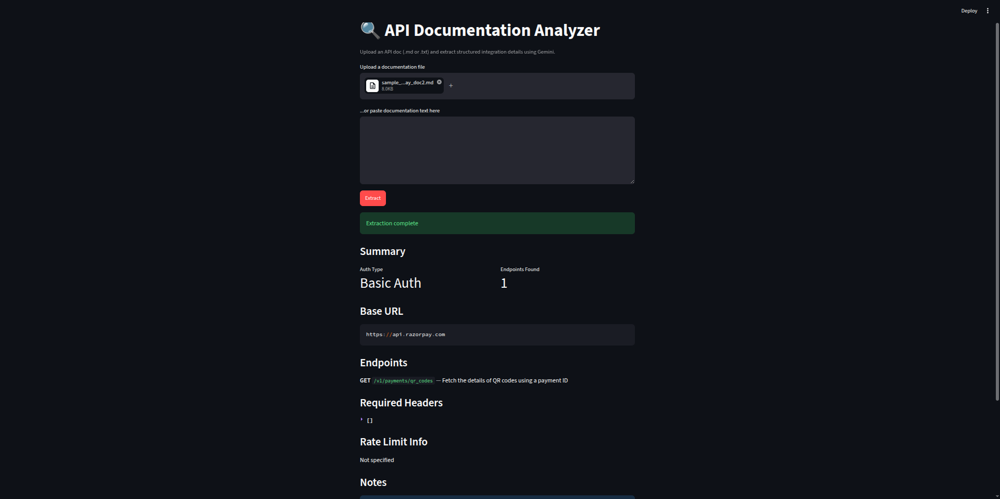

# 🔍 API Documentation Analyzer



An AI-powered tool that reads API documentation (Markdown/text) and extracts structured, standardized integration details — authentication type, base URL, endpoints, required headers, rate limits, and integration gotchas — using Google's Gemini API with enforced structured output.

Built after spending years manually parsing API docs to build integrations at scale (100+ external API integrations, spanning OAuth2, API Keys, mTLS, and JWT) — this automates the first, most repetitive step of that process.

## Why this exists

Every time you integrate a new third-party API, you spend time hunting through docs to answer the same questions: *What's the auth scheme? What's the base URL? What headers do I need? Is there a rate limit I should know about?*

This tool does that first pass automatically, turning unstructured documentation into clean, structured JSON you (or downstream tooling) can immediately act on.

## Features

- 📄 Upload a `.md` or `.txt` API doc, or paste text directly
- 🤖 Extracts auth type, base URL, endpoints, required headers, and rate limit info
- ✅ Enforced structured output (JSON schema) — no fragile prompt-and-parse guessing, no hallucinated fields
- 🚩 Flags ambiguous or noteworthy details a developer should know before integrating
- 🖥️ Simple web UI (Streamlit) — no setup beyond a Python environment

## Example

**Input:** Razorpay Payments API documentation (Markdown)

**Output:**
```json
{
  "auth_type": "Basic Auth",
  "base_url": "https://api.razorpay.com",
  "endpoints": [
    {
      "method": "POST",
      "path": "/v1/payments/:id/capture",
      "description": "Create a Payment / capture an authorized payment."
    }
  ],
  "required_headers": ["content-type: application/json"],
  "rate_limit_info": null,
  "notes": "Authentication uses Basic Auth with Key ID and Key Secret. Ensure amounts are passed in the smallest currency unit (subunits)."
}
```

## Tech Stack

- **LLM:** Google Gemini (`gemini-2.5-flash`) via `google-genai` SDK
- **Structured output:** Gemini's `response_schema` for schema-enforced JSON generation
- **UI:** Streamlit
- **Language:** Python 3.10+

## Setup

1. Clone the repo
   ```bash
   git clone https://github.com/AmitPeechara/ai-doc-analyzer.git
   cd ai-doc-analyzer
   ```

2. Create a virtual environment and install dependencies
   ```bash
   python3 -m venv venv
   source venv/bin/activate
   pip install -r requirements.txt
   ```

3. Add your Gemini API key
   Create a `.env` file in the project root:
   ```
   GEMINI_API_KEY=your-api-key-here
   ```
   Get a key at [aistudio.google.com/apikey](https://aistudio.google.com/apikey)

4. Run the app
   ```bash
   streamlit run app.py
   ```

5. Open the local URL Streamlit prints (usually `http://localhost:8501`), upload or paste an API doc, and click **Extract**.

## How it works

```
Documentation (.md/.txt)
        ↓
  Prompt + JSON Schema
        ↓
  Gemini API (temperature=0.1, structured output)
        ↓
  Validated structured JSON
        ↓
  Rendered results in UI
```

Low temperature is used deliberately — this is an extraction task, not a creative one, so deterministic output matters more than variety.

## Roadmap / Ideas for extension

- Compare two versions of the same doc and flag breaking changes (auth type changed, endpoint removed, new required fields)
- Support PDF input directly
- Batch processing of multiple docs at once
- Export results as OpenAPI/Swagger-style JSON

## Author

Amit Rao Peechara — [LinkedIn](https://linkedin.com/in/amit-peechara)